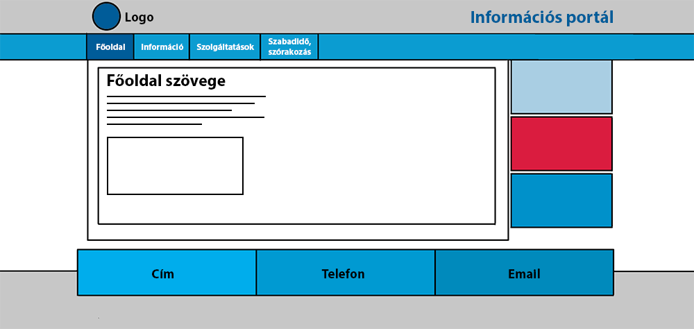
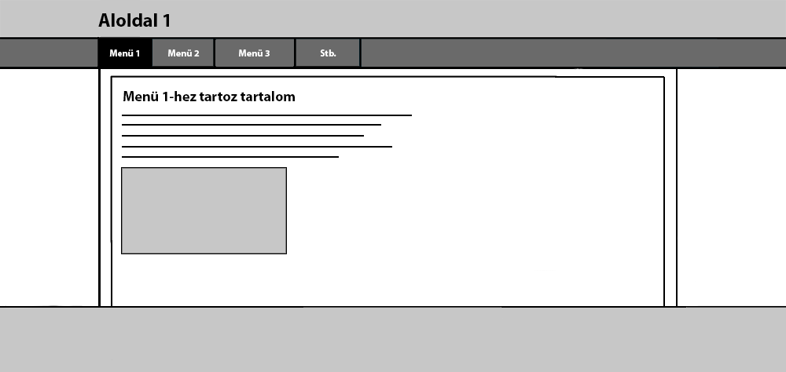

# Funkcionális specifikáció

## 1. Áttekintés
Egy több aloldalat működtető központi weboldal szolgáltatásról szól a projektünk. Célunk, hogy több érdeklődési körű felhasználó is megtalálja a saját foglalkozásának megfelelő szolgáltatást.
Több aloldal fog szerepelni a weboldalunkon, melyek például szabadidős aloldal, sportlap, kártevőirtással foglalkozó alvállalkozás oldala. Lehetőség lesz mindet megtekinteni egy portálon keresztül, és értesülni a például a sportlap híreiről, kártevőírtás igényléséről.
A felhasználók a menüben fognak tudni váltani a szolgáltatások között. A weboldal tartalmazni fog képeket, elérhetőségeket, szükséges információkat. Igény esetén nyomtatható formátumban is. A felület biztosítani fogja különböző elérhetőségeit az aloldalak szerkesztőinek, szolgáltatóinak.
Számítógépről és telefonról is optimalizált felület lesz, mindenhonnan látogatható lesz a webhely.

## 2. Jelenlegi helyzet
A COVID virusra valo tekintettel az emberek tobbnyire otthon toltik idejuket. Unalmas es repetativ eletmodot folytatva.
Aminek a valtoztatasan szertne segiteni ez a portal.
Az oldalon nemcsak szabadidos tevekenysegekhez kapcsolodo dolgok jelennenek meg, hanem akar szolgaltatasok is, ezzel segitve azokat a szolgaltatosak amik hasznosak lehetnek sok ember szamara am a virus melyen erintette uzletileg oket es minden fele fizetos portalon nehezebb lenne reklamozni sajat magukat.
Viszont az otthon unatkozo emberkenke is probal az oldal segiteni, hogy esetleg uj dolgokat ismerjenek meg, motivaciot kapjanak uj vagy regi dolgok elkezdeseben.
Akar olvassanak arrol a temarol ami erdekli, oket. Tanuljanak rola. Vagy eppenseggel formaba hozzak magukat es ne csak a kanape elott uljenek TV-t nezve.
Celunk egy atfogo portal letrahozasa ahol egyszeruen hozza lehet ferni informaciokhoz tobbefele temakorben is, el szeparalva de megis egymas mellett.

## 03. Használati esetek
Két felhasználói szerepkör atrtozik az oldalhoz: user és admin. Az adminok kezelik a weboldalat, javítják a fejlesztési hibákat, felülvizsgálják az adott aloldalak működését. A weboldalnak 4 darab főadminja lesz (fejlesztő), újabb admint csak meglévő user státuszának módosításával lehet felvenni. Az újonnan regisztráltak csak user státuszúak lehetnek, kivéve ha jogosultságot kapnak az oldal fejlesztőitől.

## 04. Vágyálomrendszer
A készítendő projekt célja egy olyan, kis méretűként induló, később korlátlanul naggyá váló portál létrehozása, mely a legkülönfélébb témakörökben nyújt egy helyen megtalálható aloldalakat. A tartalomgyártóknak, szolgáltatóknak, tőlünk kell kérniük, hogy tartalmuk elérhető lehessen a portálunkon, ahová különböző tartlamak kerülhetnek fel, melyek témaköre bármi lehet, elsősorban információs, szórakoztató, tájékoztató és bármilyen hasznos szolgáltatást nyújtó oldalak ezek. A főoldalról ezek a tartalmak kategóriákba rendezve, rövid leírással elérhetőek. Az innen megnyitott aloldalaknak nemcsak tartalma, hanem stílusa is változatos, egymástól teljesen független, hiszen ide bármilyen témakörben kerülhet fel új aloldal. A portál 4 vagy 5 aloldallal indul szabadidős, edzés, autószerelés, kártevőirtás témakörben. Amikor majd a jövőben elég mennyiség gyűlik össze ezekből, elkezdjük témakörökbe rendezni a hivatkozásokat a könnyű böngészhetőség érdekében. A portál egy olyan lehetőséget nyújt majd tehát, hogy az emberek egy helyről elérhetnek majd számukra hasznos oldalakat. Ez akkor fog látszódni igazán, ha elég nagy lesz a portál.

## 05. Követelménylista
|Modul|ID|Név|Verzió|Kifejtés|
|-----|--|---|------|--------|
|Felület|F#0101|Főoldal|1.0|A főoldal felülete jelenik meg először, itt általános információk és navigáció található a különbőző információs és szolgáltatást nyújtó aloldalakra.|
|Felület|F#0201|Szabadidős aloldal információs oldala|1.0|Általános információk, képek, friss tartalmak és ajánló található itt.|
|Felület|F#0301|Sportlap információs lapja|1.0|Üdvözlő szöveg, általános információk, képek, friss tartalmak és ajánló található itt.|
|Felület|F#0302|Sportlap bejelentkező és regisztrációs felülete|1.0|A felhasználók itt tudnak bejelentkezni a rendszerbe a funkciók eléréséhez, az új feéhasználók itt tudnak fiókot létrehozni.|
|Felület|F#0303|Sportlap: edzések menedzselése|1.0|A bejelentkezett felhasználó feliratkozhat egy edzsésre, kiválaszthatja az időpontokat, edzőt és a sportágat vagy leiratkozhat róluk, megnézheti a heti időbeosztását.|
|Felület|F#0401|Kártevőirtás információs lapja|1.0|Reklámplakát, akciók, újdonságok, bemutatkozás.|
|Felület|F#0402|Kártevőirtás: Bejelentkezés és regisztráció|1.0|Itt tudnak a felhasználók bejelentkezni és új fiókot létrehozni a kártevőirtással kapcsolatos szolgáltatások eléréséhez.|
|Felület|F#0403|Kártevőirtás: Szolgáltatás megrendelése|1.0|A bejelentkezett felhasználók megrendelhetik a kártevőirtás szolgáltatást a kiválasztott kártevő(k)re, és bejelölhetik, milyen időpontban a legalkalmasabb nekik.|
|Felület|F#0404|Kártevőirtás: Tájékoztató oldal|1.0|Tájékoztat a kártevők fajtáiról, irtásukról, a díjszabásról.|
|Jogosultság|J#0301|Sportlap: Jogosultsági szintek|1.0|- Általános felhasználó: feliratkozhat edzésre, lejelentkezhet róla beállíthatja, milyen napokon ér rá, kiválaszthat edzőt, sportágat - Edző: a sportágakhoz létrehozhat időpontokat és hozzárendelheti magát, törölheti, módosíthatja ezeket|
|Jogosultság|J#0401|Kártevőirtás: Jogosultsági szintek|1.0|- Általános felhasználó: megrendelhet házhoz jövő kártevőirtó szolgáltatást a megfelelő paramétereket beállítva. - Admin: feldolgozza a megrendeléseket, szerkeszti az oldalt, kezeli a felhasználókat.|

## 06. Használati esetek
Két felhasználói szerepkör atrtozik az oldalhoz: user és admin. A user a portál egyedi oldalait látogathatja meg és tekintheti meg majd használhatja az adott oldal tartalmait bizonyos hatáskörökig. Az admin az oldalak megfelelő futtatását és rendszeresen frissití az oldalak tartalmát hogy mindíg napra kész és mindíg valamivel több legyen. A portálnak 4 adminja lesz ezek a csoport tagjai lesznek újabb admint természetesen csak ők tudnak felvenni.

## 07. Jelenlegi üzleti folyamatok modellje
A mai világban az emberek sokszor nem tudják mit kezdjenek a szabad idejükben, ugyanis a mindennapi élet a sok munka, iskolai tevékenységek elviszik sokszor az ember életkedvét.Tegyük fel végre otthon vagy de nem tudod mit kezdj magaddal.Unatkozol és próbálnál valami hasznosat csinálni de fogalmad sincs róla mi lenne az a hasznos.Hiába ülnél le játszani mert nincs kedved hozzá esetleg nincs kivel, leülnél olvasni egy könyvet de hamar megunod ,elkezdesz nézni egy filmet de hamar bealszol rajta. Van olyan hogy csak ülsz a székedben és bámulod a plafont mert nem tudod mit kéne csinálnod és arra gondolsz hogy " bár csak lenne egy olyan oldal ahol szinte bármit bármikor csinálhatok". Erre a problémára nyújtana megoldást a Trio portál ahol sok féle dolgot csinálhatsz amikor csak akarsz.

## 8 Igenyelt uzleti folyamatok modellje
A portalunk celja, hogy az emberek atlagos, unalmas mar mar roboti eletukbol kiragadva, uj dolgokat ismerhessenek meg vagy, mar az ismert temaban melyebben el tudjon melyulni.
Mivel a portal tobb temaval foglalkozik amikre kulon kulon oldal epul, igy alaposabban el tudunk merulni egy erdekelt temaban ezzel kimenekulve a szurke hetkoznapokbol.
Oldalunk hasznalataval am azonban nem csak kulonbozo dolgokban tudunk elmelyulni vagy megismerni oket, hanem akar helybeli vagy kisebb kornyekbeli cigeket is megismerhetunk amiket sose art ismerni ha barmi olyan problemank lenne amivel ok foglalkoznak, es mivel kozelben vannak akar "ugraszthatoak" is egy egy munkara.
Az aloldalaok kozott szabadon ugralhat a felhasznalo eppen mi erdekli vagy milyen szolgaltatast keres.
Esetleg szolgaltasoknal arak osszehasonlitasa miatt amennyiben azt a szolgaltato feltuntetni.

## 9 A rendszerre vonatkozó külső megszorítások
A projekt weboldala a jogszabályok szerint fog elkészülni, szerzői joga a készítőket illeti, állami pályázatokra nem jogosult, a weboldal a természetes szabvány szerint íródik, HTML, PHP kódban, fotók számára PNG-t használ, stíluslapja CSS.

## 10. Képernyőtervek
A főoldal a portálról elérhető aloldalakat 3 nagy kategóriába rendezi: Információ, Szolgáltatások, illetve Szórakozás, szabadidő. Ennek alapértelmezett, kék színű stílusa, saját logója és címe van, minden menüpontnak kötött az elrendezése. 
  
Az egyes kategóriákban rövid leírással, képpel érhetőek el az aloldalakra vezető linkek. A Tovább gombra kattintva eljutunk a kiválasztott aloldalra.
  
Az aloldalak stílusa a portálétól és egymástól teljesen független, a fejlesztők maguk dönthetnek róla. Nemcsak a színekről, hanem a menü, a tartalom elrendezéséről is. Egyszerű navigációs szabályok betartása mellett mindenki szabadon elkészítheti saját oldalát. A képernyőterv szürke színe és vázlatossága is azt fejezi ki, hogy ennek kinézete teljesen egyéni, egyáltalán nem kötött.

## 11. Forgatokonyvek
A portal latogataskor a kezdooldalon megjelennek a portalon talalhato osszes aloldal ahova kattintassal tovabb lehet menni erdekletseg alapjan.
Az alportal nevere kattintva atiranyitodunk a kivalasztott feluletre ahol bongeszhetunk, olvshatunk az altalunk kivalasztott temakorben.
Nem tetszes vagy masik tema valasztasa eseten egyszeruen visszamehetunk a fo oldalra egy kattinttassal.
Az aloldalakon olvashatunk abban a temaban amit valasztottunk. 
Mivel minden oldal mas ezert az oldaltol fugg, hogy hany funkcio talalhato rajta es pontosan mit is lehet rajtuk csinalni.

## 12. Fogalomszótár
A reszponzív weboldal: A reszponzív weboldal (RWD) egy olyan megközelítéssel tervezett weboldal, amelynek a célja az, hogy optimális megjelenést biztosítson - könnyű olvashatóság, egyszerű navigáció a lehető legkevesebb átméretezéssel és görgetéssel - a legkülönfélébb eszközökön (az asztali számítógép monitorjától egészen a mobiltelefonokig). Progressive enhancement: A lényeg az, hogy a szöveges vagy képi tartalmi részekből minden látogató ugyanazt kapja, de mindenkinek úgy tálaljuk azt, ahogy azt a körülmények megengedik. Nevezhetnénk Content First szemléletnek is, mert lényegében arról van szó, hogy minden más weboldalelem a tartalomnak van alárendelve. Ez fontos, hiszen a weboldalak elsősorban információátadás céljából készülnek. A látványos részek háttérbe szorulnak, illetve csak akkor kerülnek képbe, ha az adott eszköz, illetve elérhető internetsebesség mellett a tartalom prezentálása zökkenőmentes.