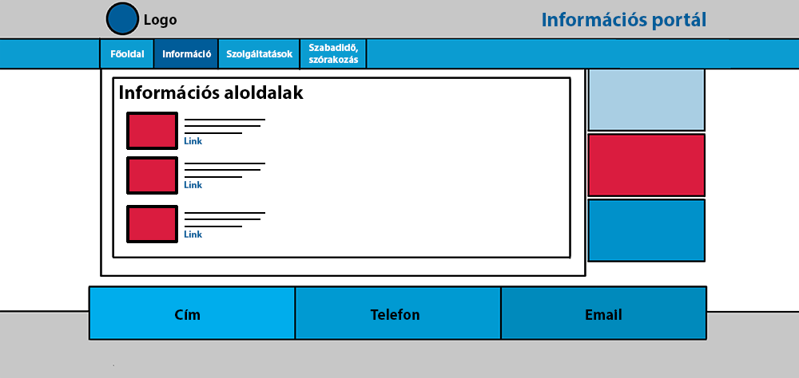

# Funkcionális specifikáció

## 2. Jelenlegi helyzet
A COVID virusra valo tekintettel az emberek tobbnyire otthon toltik idejuket. Unalmas es repetativ eletmodot folytatva.
Aminek a valtoztatasan szertne segiteni ez a portal.
Az oldalon nemcsak szabadidos tevekenysegekhez kapcsolodo dolgok jelennenek meg, hanem akar szolgaltatasok is, ezzel segitve azokat a szolgaltatosak amik hasznosak lehetnek sok ember szamara am a virus melyen erintette uzletileg oket es minden fele fizetos portalon nehezebb lenne reklamozni sajat magukat.
Viszont az otthon unatkozo emberkenke is probal az oldal segiteni, hogy esetleg uj dolgokat ismerjenek meg, motivaciot kapjanak uj vagy regi dolgok elkezdeseben.
Akar olvassanak arrol a temarol ami erdekli, oket. Tanuljanak rola. Vagy eppenseggel formaba hozzak magukat es ne csak a kanape elott uljenek TV-t nezve.
Celunk egy atfogo portal letrahozasa ahol egyszeruen hozza lehet ferni informaciokhoz tobbefele temakorben is, el szeparalva de megis egymas mellett.

## 04. Vágyálomrendszer
A készítendő projekt célja egy olyan, kis méretűként induló, később korlátlanul naggyá váló portál létrehozása, mely a legkülönfélébb témakörökben nyújt egy helyen megtalálható aloldalakat. A tartalomgyártóknak, szolgáltatóknak, tőlünk kell kérniük, hogy tartalmuk elérhető lehessen a portálunkon, ahová különböző tartlamak kerülhetnek fel, melyek témaköre bármi lehet, elsősorban információs, szórakoztató, tájékoztató és bármilyen hasznos szolgáltatást nyújtó oldalak ezek. A főoldalról ezek a tartalmak kategóriákba rendezve, rövid leírással elérhetőek. Az innen megnyitott aloldalaknak nemcsak tartalma, hanem stílusa is változatos, egymástól teljesen független, hiszen ide bármilyen témakörben kerülhet fel új aloldal. A portál 4 vagy 5 aloldallal indul szabadidős, edzés, autószerelés, kártevőirtás témakörben. Amikor majd a jövőben elég mennyiség gyűlik össze ezekből, elkezdjük témakörökbe rendezni a hivatkozásokat a könnyű böngészhetőség érdekében. A portál egy olyan lehetőséget nyújt majd tehát, hogy az emberek egy helyről elérhetnek majd számukra hasznos oldalakat. Ez akkor fog látszódni igazán, ha elég nagy lesz a portál.

## 05. Követelménylista
|Modul|ID|Név|Verzió|Kifejtés|
|-----|--|---|------|--------|
|Felület|F#0101|Főoldal|1.0|A főoldal felülete jelenik meg először, itt általános információk és navigáció található a különbőző információs és szolgáltatást nyújtó aloldalakra.|
|Felület|F#0201|Szabadidős aloldal információs oldala|1.0|Általános információk, képek, friss tartalmak és ajánló található itt.|
|Felület|F#0301|Sportlap információs lapja|1.0|Üdvözlő szöveg, általános információk, képek, friss tartalmak és ajánló található itt.|
|Felület|F#0302|Sportlap bejelentkező és regisztrációs felülete|1.0|A felhasználók itt tudnak bejelentkezni a rendszerbe a funkciók eléréséhez, az új feéhasználók itt tudnak fiókot létrehozni.|
|Felület|F#0303|Sportlap: edzések menedzselése|1.0|A bejelentkezett felhasználó feliratkozhat egy edzsésre, kiválaszthatja az időpontokat, edzőt és a sportágat vagy leiratkozhat róluk, megnézheti a heti időbeosztását.|
|Felület|F#0401|Kártevőirtás információs lapja|1.0|Reklámplakát, akciók, újdonságok, bemutatkozás.|
|Felület|F#0402|Kártevőirtás: Bejelentkezés és regisztráció|1.0|Itt tudnak a felhasználók bejelentkezni és új fiókot létrehozni a kártevőirtással kapcsolatos szolgáltatások eléréséhez.|
|Felület|F#0403|Kártevőirtás: Szolgáltatás megrendelése|1.0|A bejelentkezett felhasználók megrendelhetik a kártevőirtás szolgáltatást a kiválasztott kártevő(k)re, és bejelölhetik, milyen időpontban a legalkalmasabb nekik.|
|Felület|F#0404|Kártevőirtás: Tájékoztató oldal|1.0|Tájékoztat a kártevők fajtáiról, irtásukról, a díjszabásról.|
|Jogosultság|J#0301|Sportlap: Jogosultsági szintek|1.0|- Általános felhasználó: feliratkozhat edzésre, lejelentkezhet róla beállíthatja, milyen napokon ér rá, kiválaszthat edzőt, sportágat - Edző: a sportágakhoz létrehozhat időpontokat és hozzárendelheti magát, törölheti, módosíthatja ezeket|
|Jogosultság|J#0401|Kártevőirtás: Jogosultsági szintek|1.0|- Általános felhasználó: megrendelhet házhoz jövő kártevőirtó szolgáltatást a megfelelő paramétereket beállítva. - Admin: feldolgozza a megrendeléseket, szerkeszti az oldalt, kezeli a felhasználókat.|

## 07. Jelenlegi üzleti folyamatok modellje
A mai világban az emberek sokszor nem tudják mit kezdjenek a szabad idejükben, ugyanis a mindennapi élet a sok munka, iskolai tevékenységek elviszik sokszor az ember életkedvét.Tegyük fel végre otthon vagy de nem tudod mit kezdj magaddal.Unatkozol és próbálnál valami hasznosat csinálni de fogalmad sincs róla mi lenne az a hasznos.Hiába ülnél le játszani mert nincs kedved hozzá esetleg nincs kivel, leülnél olvasni egy könyvet de hamar megunod ,elkezdesz nézni egy filmet de hamar bealszol rajta. Van olyan hogy csak ülsz a székedben és bámulod a plafont mert nem tudod mit kéne csinálnod és arra gondolsz hogy " bár csak lenne egy olyan oldal ahol szinte bármit bármikor csinálhatok". Erre a problémára nyújtana megoldást a Trio portál ahol sok féle dolgot csinálhatsz amikor csak akarsz.

## 10. Képernyőtervek

Az egyes kategóriákban rövid leírással, képpel érhetőek el az aloldalakra vezető linkek:

