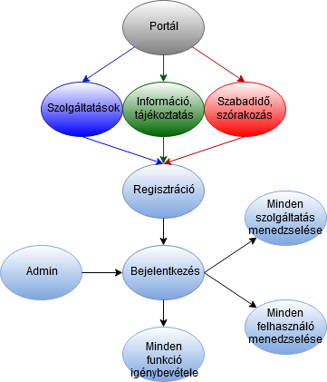
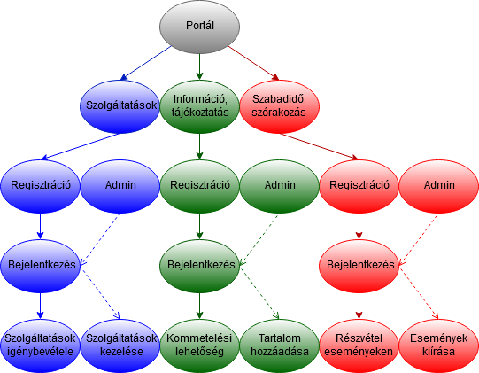

# Követelményspecifikáció
## 01.Jelenlegi Rendszerr leírása
A trio csoport egy olyan szabadidős weboldalt tervez amivel az emberek a szabadidejükben tudnak foglalkozni. A csapat viszonylag friss de az elhatározásuk meg van a projekt elkészítéséhez A Jelenlegi helyzetre hivatkozva 4-en a weboldal 1-1 részét építenénk meg amellyel a munka felosztására a kevesebb teher és több szabad idő és kevesebb stressz okozása a célunk.

## 02. Vágyálomrendszer
A projekt célja egy olyan weblap portál létrehozása amely az emberek szabadidejében lévő űrt képes betölteni. Sok olyan alkalom van amikor egy ember életében hatalmas változás történik például elköltözik, szabadságon van lényegében akármi. A portál célja az ilyen helyzetben kialakult emberek számára hogy a számukra kialakult úgymondott semmit tevést felváltsa és esetleg valami új hobbi megtalálása. Regisztrációt követően több típusú feladat közül választhat a felhasználó.Látványos, színes felülettel rendelkezik a portál, hogy felkeltse a felhasználók figyelmét..A rendszernek van egy admin felülete is, ahol az adminfiókkal bejelentkezett felhasználó fel tudja tölteni a feladványokat.

## 04. Jelenlegi üzleti folyamatok modellje
Olyan portálok, melyek kategóriákba rendzeve biztosítanak hozzáférést szolgáltatást, információt vagy szórakoztató tartalmat biztosító tartalmakhoz, sokféle felépítéssel, sokféleképpen megvalósítva léteznek. A jelenlegi üzleti folyamatok modelljében olyan modellt mutatok be, mely bizonyos portálokra jellemző, de nem a projket keretei között készített portálra. Ebben a portál főoldaláról elérhető a regisztráció, illetve a bejelentkezés. Miután a felhasználó belépett, ez az egy regisztráció a portál összes szolgáltatásának és funkciójának a használatára jogosulttá tette, nem kell az aloldalak funkcióinak használatához külön regisztrálnia. Az adminok is alapértelmezetten mindenhez hozzáférnek, de testre is szabható mindegyiknek a jogosultsági köre. Nagy portál esetén nehéz behatárolni a jogosultságokat ebben az esetben.

## 05. Jövőbeli üzleti folyamatok modellje
A projekt célja létrehozni egy olyan információs portált, mely a legáltalánosabb kategóriákba gyűjtve nyújt hozzáférést bármilyen témájú tartalomhoz. A fő témakörök: Szolgáltatások; Információ, tájékoztatás; Szórakozás, szabadidő. Ezeken belül az aloldalak témája és megjelenése bármilyen változtatos lehet. Az általunk tervezett portál modellje a jelenleginél bemutatott modelltől eltérő lesz. Itt minden kategóriában, azokon belül is minden aloldalon külön kell regisztrálniuk és bejelentkezniük a felhasználóknak, és az adott regisztrációval csak az adott aloldal funkcióit vehetik igénybe, már ha egyáltalán szükséges regisztrálni. Az ábrán nem látszik egyértelműen, de nem kategóriánként kell regisztrálni, hanem minden kategóriához tartozó minden egyes weboldalhoz, melynek funkcióit használni szeretné a látogató, külön kell ezt megtenni, ha egyáltalán biztosít az adott aloldal ilyen lehetőséget. Minden aloldalhoz külön adminok is tartoznak, így azok jogosultsága egyértelműen a hozzá tartozó rész felhasználóinak, tartalmának és funkcióinak kezelésére terjed ki.

## 6. Kovetelmenylista
Jogosultsag - Bejelentkezesi felulet - Csak az admin rendelkezik bejelentkezesi lehetoseggel, hogy szerkeszteni tudja az oldalakat
Jogosultsag - Jogosultsagi szintek - Admin: A rendszer egeszehez hozzafer, barmikor modosithat informaciokat az letezo oldalakon, vagy akar teljesen uj oldalt is hozza adhat.
								   - Felhasznalo/Vendegk: Bejelentkezes nelkul bongeszhet az oldalon, csak olvasasi jogosultsaggal rendelkezik semmi massal.	
Felulet - Dizajn - Az aloldalak lehetoleg reszponziv felulettel rendelkezzenek 
Jogosultsag - Admin felulet - Csak az admin fiokkal rendelkezo szemelyek ferhetnek hozza

## 8. Fogalomszotar 
Portal - Gyujto felulet, tobb oldal szerepel rajta
Oldal - Ahol az informaciok szerepelnek egy-egy bizonyos temaval kapcsolatban
MySQL - Relacios adatbazis kezelo rendszer 
SQL - Structured Query Langauge - strukturalt lekerdezonyelv - a relacios adatbazis lekerdezeso nyelve.
HTML - Hyper Text Makeup Langauge - hiperszoveges jelolonyelv - weboldalak keszitesehez kifejlesztett leironyelv.
CSS - Cascading Style Sheets - egymasba agyazott stilusalapok - stilusleiro nyelv, mely a HTML tipusu strukturalt dokumentumok megjeleneset irja le.
Front-End - A felhasznalohoz kozelebb eso vege a programnak, funkciojat tekintve a front-end az ami megjeleniti az informaciokat a felhasznalonak
Back-End - A felhasznalohoz tavolabb eso vege a programnak, finkciojat tekintve a back-end az ami eloallitja az informaciokat ami a front-end en fognak megjelenni. A back-end et nem latjuk, csak tapasztaljuk

## 12. Vágyálomrendszer
A projekt célja egy olyan weblap portál létrehozása amely az emberek szabadidejében lévő űrt képes betölteni. Sok olyan alkalom van amikor egy ember életében hatalmas változás történik például elköltözik, szabadságon van lényegében akármi. A portál célja az ilyen helyzetben kialakult emberek számára hogy a számukra kialakult úgymondott semmit tevést felváltsa és esetleg valami új hobbi megtalálása. Regisztrációt követően több típusú feladat közül választhat a felhasználó.Látványos, színes felülettel rendelkezik a portál, hogy felkeltse a felhasználók figyelmét..A rendszernek van egy admin felülete is, ahol az adminfiókkal bejelentkezett felhasználó fel tudja tölteni a feladványokat.