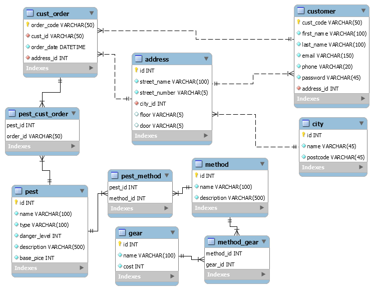

# Rendszerterv
## 01. A rendszer célja
A rendszer célja egy szabad idős portál létrehozása amelyhez bárhol bárki bármikor hozzáférhet. Az oldal kinézete egy színes figyelemfelkeltő felület lesz. A rendszer kinézete miatt egyszerűen kezelhető lesz.Mivel jelenleg csak weboldal keszul ezert sem androidos sem IOS es alkalmazas nem fog keszulni, de mivel celunk egy egyszeruen attekintheto oldal letrehozasa, ami minimalis eroforrasokat hasznal igy nincs is tervben kulon applkiacio letrehozasa. 

## 02. Projektterv
**Rendelkezésre álló szoftvererőforrások:**
- Windows 10 operációs rendszer
- WAMP szerver
- Sublime Text 3 IDE
- MySQL localhost szerver  
**Rendelkezésre álló hardvererőforrások:**
- Fejenként legalább egy IBM PC 8 vagy 16 GB RAM-mal, 1 TB SSD vagy HDD tárhellyel, i5-ös vagy i7-es processzorral  
**Rendelkezésre álló idő, ütemterv:**
- Funkcionális és követelményspecifikáció: 1. hét
- Rendszerterv: 2. hét
- Alapprojekt kialakítása és szükséges anyagok (szövegek, képek) összegyűjtése, adatbázisok létrehozása: 3. hét
- Főbb funkciók és autentikáció kidolgozása: 4. hét
- Stílus, megfelelő struktúra kialakítása: 5. hét
- Tesztelés: 6. hét  
**Projekt szerepkörök, felelősségek:**
- Az információs oldalak kialakításáért felel: Pelle Marcell
- A sporttal kapcsolatos szolgáltatások és információk fejlesztése: Dohányos Patrik
- A szabadidős tartalmak és funkciók fejlesztése: Perge Zsolt
- A közérdekű szolgáltatások kategóriájába tartozó aloldalak fejlesztése: Faragó Zsófia
- A főoldal kialakítása, menühierarchia, navigáció: Faragó Zsófia

## 3 Uzleti folyamatok modellje

A celunk egy olyan portal letrehozasa melynek segitsegevel az emberek valtoztatni tudnak az unalmas mindennapjaikon.

Uzleti szereplok:

-Szolgaltatast nyujto cegek, akik megjelennek az oldalon
-Latogatok
-Adminok

Uzleti folyamatok:
- A latogatok elerhetik az osszes aloldalt, minden megjelenitett informaciot, regisztralas nelkul bongeszhetnek es olvashatnak
- Az adminok publikaljak es szerkesztik az aloldalakat. Barmilyen dolog miatt hozza fernek akar informacio hozzaadasa vagy torlese

## 4 Követelménylista

A rendszer fejlesztese HTML/CSS valamint esetlegesen JavaScript segitesegevel tortenik A weboldal felepitese HTML, a stilusa CSS-sel fog megvalosulni. A weboldal hasznalatahoz eleg lesz egy egyszeru bongeszo.

## 5 Funkcionalis terv

Renszerszereplok: Adminok, Latogatok
Mivel az oldal egy gyujtoi portal, igy nincs szukseg tobb felhasznalora, csak az aminok akik publikalni tudnak es egyszeru olvasok akiknek nem kell regisztralni.

Rendszerhasznalati eset
Admin: Teljes hozzaferesz az egesz rendszerhez, ezaltal barmilyen aloldalt, informaciot megjelenithetnek vagy epp elrejthetnek.
Latogato: A portal osszes megjelentitett aloldalat elerik, ezaltal szabadon bongeszhetnek

Menuhierarchia:
Bejelentkezes: Csak az adminok reszere
Fooldal: Az osszes aloldal kulon kulon megjelenitve. 
		 Az aloldalak felosztasa mind egyedi csak az adott oldalhoz kapcsolodik. (Informacio, Elerhetosegek stb.)

## 6 Fizikai kornyezet
A portal csakis web platformra keszul
A portal kezi kodolassal irodik
A weboldal eleresehez csak egy atlagos bongeszora van szukseg
	Ezaltal barhonnan elerheto, operacios rendszertol es bongeszotol fuggetlenul
Az oldal fejlesztese HTML/CSS, JavaScript es PHP segitsegevel tortenik.

Fejlesztoi eszkozok:
	Szoveg -es forraskodszerkesztok: Visual Studio Code, Notepad++, Sublime text stb, kedv szerint barmelyik
	Weboldal: HTML + CSS + JavaScript + PHP
	Adatbazis: MySQL	

## 07. Architekturális terv
A rendszerhez szükség van egy adatbázis szerverre, ebben az esetben MySql-t használunk. A kliens oldali programokat egy php alapú REST api szolgálja ki, ez csatlakozik az adatbázis szerverhez. A kliensekkel JSON objektumokkal kommunikál.	

## 08. Adatbázisterv
A portál kezdeti aloldalai közül elsőként csak a kártevőirtáshoz mint szolgáltatáshoz készül adatbázis, ennek a tervét mutatja a mellékelt ábra.  
  
**A customer tábla:**  
Tartalmazza a beregisztrált megrendelők adatait: vezeték- és keresztnevét, címét (idegen kulccsal az address táblához kapcsolva), email címét, telefonszámát, titkosított jelszavát. A tábla azonosítója a vevőkód.
**Az address és a city tábla:**  
Az adressben találhatóak a címadatok, úgy, mint az utcanév, házszám, és a város adataihoz tartozó city_id idegen kulcs. Opcionálisan megadható emelet, ajtó is. A city táblában a városok neve és irányítószáma található. Az ismétlődés elkerülése céljából ezeket az adatokat külön táblában tároljuk, és az addressben idegen kulccsal hivatkozunk a rekordjaira. Az address és a city táblák között egy a sokhoz kapcsolat van: egy városban sok cím található, de egy címhez csak egy város köthető.
**A pest (kártevő tábla):**  
A kártevők nevét, típusát, rövid leírását, veszélyességi szintjét tartalmazza, illetve az alapdíjat, amennyiért az irtása vállalható.
**A method és a pest_method tábla:**  
A kártevőirtásra használt módszerek nevét, rövid leírását tartalmazza ez a tábla. A pest_method kapcsolótábla mondja meg, hogy melyik kártevőhöz melyik módszer a megfelelő. Azért kell a kapcsolótábla, mert egyféle kártevőt több módszerrel is lehet irtani, egy módszer pedig többféle kártevőre is jó lehet.
**A gear és a method_gear tábla:**  
A gear táblában a kártevőirtáshoz használt felszerelések nevét és költségét tároljuk, a method táblához a method_gear kapcsolótáblával kapcsolhatóak, mert egyféle felszerelést több módszerhez is fel lehet használni, és egy eljáráshoz több felszerelés is szükséges lehet.
**A cust_order és a pest_cust_order táblák:**  
A cust_orderben megrendelések találhatók, melyeket a vevők adtak le, a cust_id idegen kulcs tárolja a vevő id-jét, az order_date a megrendelés dátumát, az address_id pedig a helyszín címét adja meg. A rendelés kódja az azonosító. Azért szükséges a címet itt is feltüntetni, mert a kártevőirtás helye nem biztos, hogy megegyezik a vevő címével.

## 09. Implementációs terv

Web: A webes felület HTML, PHP, CSS valamis Javascript nyelven készül. Minél átláthatóbban, elkülönítettebben fogunk dolgozni, a projekt átláthatósága miatt. Adatbázishoz SQL rendszert használunk az adatbázisterv pont szerint.

## 12. Karbantartási terv
**Jogkörökkel, adminisztrációval, fejlesztéssel kapcsolatos feladatok:**
- A portál jelenleg 4 ember fejlesztésével indul, és ezek az emberek tartják az aloldalakat karban. Ez már nem lesz fenntartható, ha a portál tartalma bővül, szükség lesz adminisztrátorokat felvenni, akik a meglévő oldalak tartalmáért és felhasználóiért felelősek. Először csak kategóriánként, később szűkebb alkategóriánként akár többet is.
- Az aloldalakat továbbra is a fejlesztők készítik majd el megrendelésre, de ha a megrendelések száma túl nagy lesz, hogy azt 4 ember kiszolgálja megfelelő időn belül, újabb fejlesztőket is kell mad alkalmazni.
- Szponzoráció, hirdetők szükségesek a kiadások fedezésére és a bevétel növelése érdekében.  
**Az oldal felépítésével kapcsolatos módosítások:**
- A portál bővülésével a menüstruktúrát át kell majd alakítani: több kategóriába kell majd rendezni a tartalmakat, és a főkategóriákat minél több almenüpotba kell majd sorolni a hatékonyabb böngészhetőség érdekében.
- Ha a portált már elég sokan látogatják, érdemes hirdetéseket megjeleníteni: először csak a kezdőoldal jobb oldalsó sávjában, később minden aloldalon ugyanitt, egységesen. Azonban soha nem felugró ablakokban vagy a tartalmi részben elhelyezve, hogy ne zavarja a látogatókat a sok reklám.  
**Új funkciók bevezetése:**
- Százas nagyságrendű aloldalszám esetén mindenképpen érdemes bevezetni kulcsszavas keresési lehetőséget a portálon.
- Nemcsak külön-külön az aloldalakon, hanem a portálra globálisan nézve is be kell vezetni egy regisztrációs lehetőséget további funkciók megvalósításához, úgy mint:
	- Kedvencek összeállítása: a leggyakrabban látogatott aloldalak elérése a saját fiókunkból egy helyen.
	- Hírlevél küldése a felhasználóknak a portállal kapcsolatban
	- Aloldalak értékelése, vélemény írása
- Mobilalkalmazás formájában is elérhetővé kell tenni a portál legkeresettebb szolgáltatásait Andoid és iOS platformon.